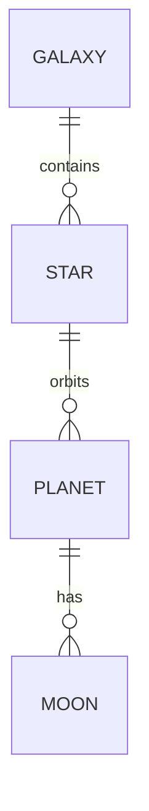

# Universe Database: freeCodeCamp Certification

This project is part of the freeCodeCamp **Relational Database** curriculum. The primary objective was to design and populate a relational database using **PostgreSQL** to represent various elements of the known universe.

## 🚀 Project Features

The database is named `universe` and features a hierarchical structure connecting galaxies to their respective systems and moons.

### Database Structure:
* **Galaxy**: Information about different galaxies (spiral, elliptical, etc.).
* **Star**: Stars linked to a specific galaxy.
* **Planet**: Planets orbiting those stars.
* **Moon**: Natural satellites associated with each planet.
* **Galaxy Types**: An additional table to categorize galactic morphology.

## 📐 Structure and Relationships (ERD)



## 🛠️ Technical Details

* **Database Engine:** PostgreSQL.
* **Relationships:** Implementation of primary keys (`PRIMARY KEY`) and foreign keys (`FOREIGN KEY`) to maintain referential integrity.
* **Data Types:** Use of `INT`, `NUMERIC`, `TEXT`, `VARCHAR`, and `BOOLEAN`.
* **Constraints:** Use of `UNIQUE`, `NOT NULL`, and auto-incrementing fields (`SERIAL`).

## 📊 Database Statistics

To meet certification requirements, the database includes:
- **6** Galaxies.
- **6** Stars.
- **12** Planets.
- **20** Moons. ## 🛠️ Concepts Demonstrated

* **Normalization and Foreign Keys**: Ensuring referential integrity between hierarchical entities (Galaxy ➔ Star ➔ Planet ➔ Moon).
* **Integrity Constraints**: Strict use of `NOT NULL`, `UNIQUE`, and appropriate data types (Integers, Strings, Booleans, Floats/Numerics).
* **DDL & DML Scripts**: Structured table creation and initial data insertion, ready for execution.

## ⚙️ How to Rebuild the Database

If you wish to replicate this project locally, ensure you have PostgreSQL installed and follow these steps:

1. Create the database:
```bash
createdb universe
```
2. Import the SQL file:
```bash
psql universe < universe.sql
```

## 🔍 Example Queries
```SQL
-- Get all planets with their corresponding star and galaxy names
SELECT
planet.name AS planet,
star.name AS star,
galaxy.name AS galaxy
FROM planet
JOIN star ON planet.star_id = star.star_id
JOIN galaxy ON star.galaxy_id = galaxy.galaxy_id;
```

---

## 📜 Credits and Acknowledgments

* **Assignment/Dataset Origin:** This project is one of the required challenges for obtaining the **Relational Database Certification** from [freeCodeCamp](https://www.freecodecamp.org/).
* **Implementation:** The Bash script logic (`insert_data.sh`), the PostgreSQL schema structure (`worldcup.sql`), and the analytical queries (`queries.sh`) were developed entirely as an individual solution to the assigned problem.
